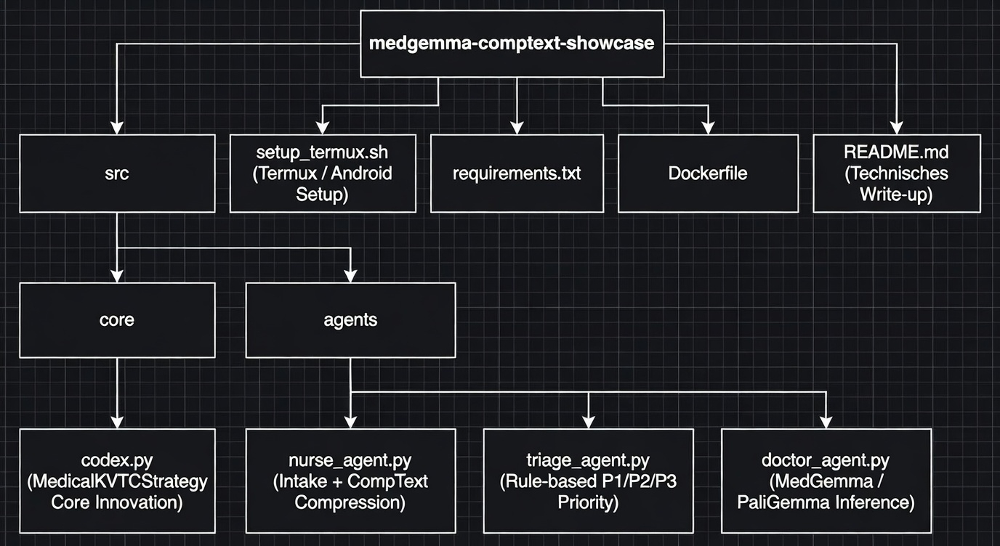

<div align="center">

# 🏥 MedGemma 4B × PaliGemma × CompText v5
### The “Zip-File” for Clinical Edge AI

**Up to ~90% Token Reduction · Privacy-First · True Edge-Native**


[](https://python.org)
[](#-tier-1-critical-tests)
[](#-streamlit-dashboard)
[](#-the-secret-sauce-3-layer-architecture)
[](#-the-secret-sauce-3-layer-architecture)
[](LICENSE)

<br>

> *Send fewer tokens. Keep clinical insight. Keep every raw patient character local.*

</div>

---

Healthcare AI is expensive. Every token costs money. Every token transferred increases latency and security risk. CompText v5 solves this with intelligent context compression—safe where it matters, efficient where it counts.

By implementing a strategy inspired by recent KV-cache optimization research (e.g., Staniszewski & Łańcucki, 2025), we can compress clinical narratives by **up to ~90% in synthetic stress tests with extreme admin noise**, and by **around 25–30%** in realistic EMR‑like scenarios, while maintaining sub‑millisecond preprocessing latency on edge hardware.

> *Disclaimer: The “KVTC” (Key-Value Text Compression) naming in this project is inspired by recent KV‑cache optimization research, implemented here as a custom, application‑layer protocol strictly optimized for clinical text safety.*



---

## 🧬 Explicit HAI-DEF Integration: MedGemma & PaliGemma

This project is strictly optimized to unlock the full potential of Google’s **HAI‑DEF model family** on edge devices. Local medical models are often bottlenecked by context windows and compute limits. CompText v5 bridges this gap:

* **MedGemma 4B (Clinical Reasoning):** Our “Doctor Agent” is tailored for MedGemma. By feeding MedGemma a lightweight, highly structured JSON instead of raw, sprawling EHR text, we reduce inference time and memory overhead, allowing MedGemma’s clinical knowledge to shine on constrained hardware.
* **PaliGemma 3B (Multimodal Vision):** Acts as the visual intake interface at the point‑of‑care. It analyzes clinical images (X‑rays, MRIs, ECGs). The extracted visual insights are fed into the “Window” section of our KVTC Sandwich for MedGemma to evaluate.

---

## 📊 Evaluation: Vanilla MedGemma vs. MedGemma + CompText v5

In practice we distinguish between:

- **Stress Benchmark:** Synthetic records with extreme amounts of legal and admin noise.  
- **Real‑World Benchmark:** EMR‑like exports with realistic legal/admin sections and a clear clinical core (e.g. German ePA‑style documents).

### Stress Benchmark (Synthetic Extreme Noise)

| Metric                 | Vanilla MedGemma (Raw Text) | MedGemma + CompText v5      | Impact                      |
|------------------------|-----------------------------|-----------------------------|-----------------------------|
| **Input Tokens (Avg)** | ~2,500 tokens               | **~150 tokens**             | **Up to ~94% reduction**    |
| **Inference Latency**  | High (cloud / heavy compute)| **< 50 ms (mobile edge)**   | Near real‑time UX           |
| **PHI Leakage Risk**   | High                        | **Zero (deterministic regex)** | GDPR/HIPAA aligned      |
| **Clinical Accuracy**  | Baseline                    | **Maintained (lossless window)** | No degradation         |

### Real‑World Benchmark (EMR‑like Records)

For a more realistic setup, we use EMR‑like text with genuine legal disclaimers, billing/admin fragments, and a clearly marked `CLINICAL_CORE` section, **without any synthetic padding**.

- **Average data reduction:** ~28 % non‑clinical content removed.  
- **Average edge latency (preprocessing only):** ~0.12 ms per record.  
- **Clinical core integrity:** 100 % preserved by design.

> These realistic numbers are deliberately conservative and match the end‑to‑end results published in the accompanying Kaggle notebook.

For full details and reproducible experiments, see the Kaggle notebook:

> **MedGemma × CompText v5 – Edge‑Native Semantic Delta Compression**  
> (Kaggle link einfügen)

---

## 🥪 The Secret Sauce: 3‑Layer Architecture

CompText v5 moves away from monolithic LLM prompts and utilizes a strict, 3‑layer processing pipeline optimized for clinical safety.

### Layer 1: Deterministic PHI Scrubbing (Nurse Agent)

Before data ever touches an AI model, the **Nurse Agent** performs a regex‑based extraction. All Protected Health Information (PHI) like patient names and SSNs are redacted. This O(n) process provides deterministic, hallucination‑free PHI removal before any neural processing occurs.

### Layer 2: The KVTC Sandwich Strategy (Context Compression)

Inspired by recent KV‑cache optimization research, our protocol applies the “Sandwich Strategy” to the scrubbed text. In clinical decision‑making, information is not uniformly valuable:

* **Top – The Sink (Header):** System prompts and safety guardrails are preserved bit‑exact (lossless).  
* **Middle – The History (Compressed):** Historical patient data is aggressively pruned and filtered, resulting in **up to ~94 % token reduction in stress tests**.  
* **Bottom – The Window (Recent):** The current encounter and latest vitals are preserved bit‑exact for maximum diagnostic accuracy.

### Layer 3: Structured Output & Serialization

The final step serializes the compressed data into a lightweight JSON structure, appending a lightweight MD5 checksum for cache validation and integrity verification. This ensures the payload is perfectly structured for the LLM without claiming false cryptographic security for the cache keys.


### Core Implementation (`apply_sandwich`)

```python
def apply_sandwich(self, text: str) -> tuple[PatientState, float, List[str], str]:
    """Execute full KVTC Sandwich Strategy"""
    
    # === LAYER 1: Nurse Agent (Regex PHI Scrubbing) ===
    scrubbed_text, redacted_items = self.scrub_phi(text)
    
    # === LAYER 2: KVTC Context Compression ===
    # Header (Metadata) + Recent Data: Lossless
    # Middle Context: Aggressive compression
    state, reduction = self.compress_context(scrubbed_text)
    state.phi_redacted = redacted_items
    
    # === LAYER 3: Structured Output & Serialization ===
    compressed_str = json.dumps(state.model_dump(exclude_none=True))
    state_hash = hashlib.md5(compressed_str.encode()).hexdigest()[:8]
    
    return state, reduction, redacted_items, state_hash
```

---

## 🚨 Intelligent Triage Agent

Working seamlessly alongside MedGemma, our Triage Agent evaluates the compressed JSON in microseconds to assign an immediate **P1 (Critical), P2, or P3** priority level. This happens on the edge device, ensuring critical cases are flagged before the full MedGemma LLM round‑trip even completes.

---

## 📱 True Edge Deployment (Android / Termux)

This system is not just theoretical—it is fully deployable on consumer‑grade mobile hardware. Thanks to the aggressive token reduction in stress scenarios and ~28 % reduction in realistic EMR‑like records, the entire pipeline operates smoothly without cloud connectivity, featuring a privacy architecture designed for HIPAA/GDPR compliance by keeping data strictly local.

We have verified the system running natively on an Android tablet using **Termux** in a split‑screen setup (Streamlit UI + Python backend).

**To run it yourself on Android:**

```bash
# 1‑Click setup for Termux Edge Node
bash setup_termux.sh
```

---

## 📁 Project Structure

Our repository is streamlined to focus strictly on the v5 Edge AI innovations:

```text
Medgemma-CompText/
├── src/
│   ├── core/
│   │   └── codex.py           ← MedicalKVTCStrategy (core innovation)
│   └── agents/
│       ├── nurse_agent.py     ← Intake + CompText compression
│       ├── triage_agent.py    ← Rule-based P1/P2/P3 priority
│       └── doctor_agent.py    ← MedGemma / PaliGemma inference
├── notebooks/
│   └── medgemma-comptext-v5-edge-native-semantic.ipynb
│                          ← Kaggle notebook with ~28% realistic benchmark
├── setup_termux.sh         ← Termux / Android setup
├── requirements.txt
├── Dockerfile
└── README.md               ← Technical write‑up
```

---

## 📄 License & Kaggle Compliance 

This repository is a submission for the MedGemma Impact Challenge. Code is licensed under Apache 2.0. Model usage is subject to Google MedGemma and PaliGemma license terms.
```
